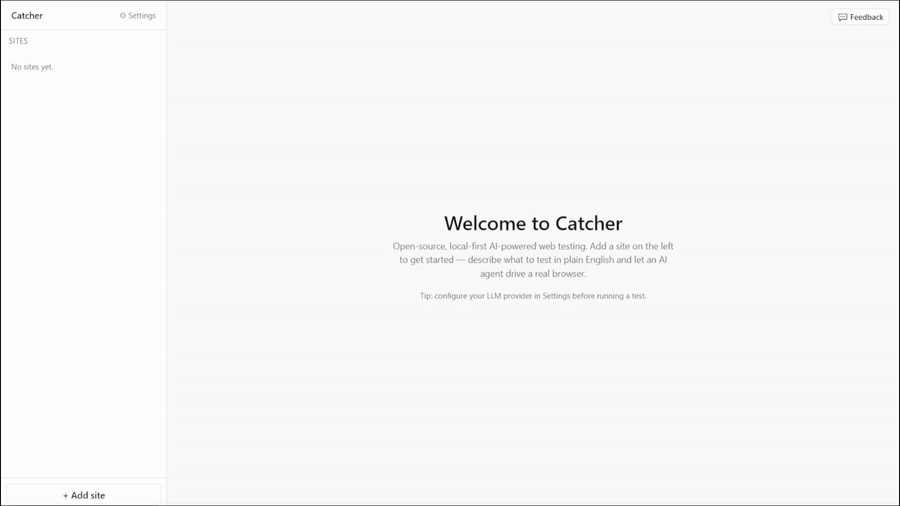

# Catcher

**English** | [简体中文](README.zh-CN.md)

> **Open-source, local-first, BYOK AI web testing.** Describe tests in English, run them in a real browser on your machine.

[](https://github.com/Catcher2026/Catcher/releases)
[](LICENSE)
[](https://github.com/Catcher2026/Catcher/actions/workflows/ci.yml)



## ✨ How it's different

Most AI testing tools are paid SaaS that runs your tests on their cloud with their LLM. Catcher is the opposite:

- **Desktop app, not a service** — your sites, sessions, cookies and screenshots never leave your machine
- **BYOK LLM** — point it at OpenAI / Anthropic / Gemini / Ollama / any OpenAI-compatible endpoint; you pay the provider directly
- **Vision-coordinate fallback** — when a click misses through every selector strategy, Catcher screenshots the page and asks the LLM to point at `{x, y}`. Recovers from overlays, animations, and CSS occlusion that break other planners
- **MIT-licensed, no telemetry** — fork it, audit it, ship it inside your company

## 📝 What it looks like

You write steps in natural language; Catcher runs them in Playwright:

```
Click the 'Sign in' button
Type 'alice@example.com' in the email field
Type 'hunter2' in the password field
Click the 'Continue' button
Verify the page contains 'Welcome, Alice'
```

Each step goes through a heuristic match on the live DOM first; the LLM is only invoked when the heuristic isn't confident. That keeps simple tests fast and cheap — most clicks never hit the API.

## 📦 Install

Download the latest installer for your platform from the [Releases page](https://github.com/Catcher2026/Catcher/releases):

- **Windows** — `Catcher Setup x.y.z.exe` (NSIS installer, ~290 MB)
- **macOS Apple Silicon** — `Catcher-x.y.z-arm64.dmg`
- **macOS Intel** — `Catcher-x.y.z.dmg`

> The installers are **unsigned** (no Apple Developer or Windows code-signing certificate yet).
>
> - Windows SmartScreen will warn "Unknown publisher". Click **More info → Run anyway**.
> - macOS Gatekeeper will refuse to open the app on first launch. Right-click the app → **Open**, then confirm. Or run `xattr -dr com.apple.quarantine /Applications/Catcher.app`.

## 🚀 Quick start

1. Launch Catcher.
2. Open **Settings** → pick a model from the dropdown (GPT-4o, Claude Sonnet, Gemini Pro, etc.) and paste your API key. All preset models support vision (used for the coordinate-fallback feature).
3. Click **+ Add site**, give it a URL.
4. Click **+ New test** → add steps.
5. Press **▶ Run this test**. Watch the live browser preview in the right drawer.

For a richer guide on writing steps that the planner handles reliably, see [`PROMPT_WRITING_GUIDE.md`](PROMPT_WRITING_GUIDE.md). The short version:

- **Quote any literal**: `Click the 'Save' button`, `Type 'hello' in the search box`, `Verify the page contains 'Order placed'`. Quoted strings get a deterministic substring match — they almost can't go wrong.
- **One action per step.** Split "fill the form and submit" into separate Acts.
- **For asserts**, quote whatever the user would actually see on the page.

## 🎯 Features

- **Three step types** — Act (LLM-planned click/type/hover/etc.), Assert (deterministic when quoted; LLM-judged otherwise), Wait (plain pause in seconds)
- **Auth profiles** — sign in once via a real browser window, the session persists. Each test pins its own profile; Run-all uses it
- **AI generate steps** — describe a flow, Catcher inspects the live page and drafts a step list you can edit
- **Live run drawer** — streams the browser viewport + per-step reasoning so you see exactly what the planner clicked and why

## ⚙️ Configuration

Settings are stored in `~/.catcher/settings.json`. Most users only need to touch:

| Field | Default | Notes |
|---|---|---|
| LLM provider + model | OpenAI `gpt-4o-mini` | Pick from the Settings dropdown — all presets support vision |
| API key | empty | Stored locally; sent only to the provider you chose |
| Send screenshot to LLM | on | Required for vision-based click fallback. Pre-defined models all support this. Custom endpoints may not — accuracy drops if their model lacks vision |
| Headless | on | Turn off to watch the browser locally during a run |
| Action timeout | 5000ms | How long Playwright waits before falling back |
| Confidence threshold | 0.7 | Asserts below this become "needs review" instead of pass/fail |

## 🏗️ Architecture

```
┌─────────────────────────────────────────────────────────┐
│                      Renderer (React)                   │
│  Sidebar · Tests · Editor · Run drawer · Settings       │
└──────────────────────────┬──────────────────────────────┘
                           │ IPC (window.catcher)
┌──────────────────────────┴──────────────────────────────┐
│                  Main process (Electron)                │
│                                                         │
│  ┌──────────┐  ┌──────────┐  ┌──────────┐ ┌──────────┐  │
│  │ storage  │  │  runner  │  │ generate │ │   auth   │  │
│  └──────────┘  └────┬─────┘  └─────┬────┘ └────┬─────┘  │
│                     │              │           │        │
│              ┌──────┴──────────────┴───────────┴─────┐  │
│              │   snapshot · actions · llm clients   │  │
│              └─────────────────┬────────────────────┘  │
└────────────────────────────────┼────────────────────────┘
                                 │
                          Playwright (Chromium)
```

- `electron/runner.ts` — execution engine: per-step plan, retry, vision fallback, screencast, cancel handling
- `electron/snapshot.ts` — collects the ARIA tree + ranked clickable list + overlay detection that the planner sees
- `electron/actions.ts` — translates a `PlannedAction` into a Playwright call, with the click fallback chain (Playwright click → corner-click for backdrops → native `el.click()` via `page.evaluate` → vision coordinates)
- `electron/generate.ts` — AI test-generation (looks at the live page once, drafts a step list)
- `electron/llm.ts` — provider-agnostic completion API (OpenAI, Anthropic, Gemini, OpenAI-compatible)

## 🔧 Development

Requirements: Node 20+, Git.

```bash
git clone https://github.com/Catcher2026/Catcher.git catcher
cd catcher
npm install            # postinstall downloads Chromium into node_modules/playwright-core/.local-browsers
npm run dev            # vite + electron in watch mode
```

### Useful scripts

| Script | Purpose |
|---|---|
| `npm run dev` | Run the app in watch mode (Vite + Electron, hot reload) |
| `npm test` | Run unit tests (vitest) — covers the heuristics and LLM-plan parsing |
| `npm run build:renderer` | Type-check + build the React renderer |
| `npm run dist:win` | Build the Windows installer (NSIS `.exe`) into `release/` |
| `npm run dist:mac` | Build the macOS `.dmg`s into `release/` *(must run on macOS)* |
| `npm run dist` | Build both at once *(macOS only)* |

### Repo layout

```
catcher/
├── electron/                Main process (Node) — runner, snapshot, actions, LLM clients
│   ├── runner.ts            Execution engine: snapshot → plan → execute → assert, with retry/cancel
│   ├── snapshot.ts          Captures ARIA tree + ranked clickables + overlays for the planner
│   ├── heuristics.ts        Pure tokenization + click-target ranking (unit-tested)
│   ├── planParser.ts        LLM-plan JSON validation, throws InvalidPlanError (unit-tested)
│   ├── actions.ts           Translates a PlannedAction into Playwright calls with fallback chain
│   ├── generate.ts          AI test-generation (drafts step list from a live page)
│   ├── llm.ts               Provider-agnostic completion client (OpenAI / Anthropic / Gemini / OpenAI-compat)
│   ├── pricing.ts           Token-cost estimation per provider
│   ├── auth.ts              Persistent auth-profile management (login once, reuse the session)
│   ├── storage.ts           Local JSON store under ~/.catcher/ (sites, tests, runs, settings)
│   ├── engine.ts            Browser-type selection
│   ├── main.ts              Electron main-process entry; IPC handlers
│   ├── preload.ts           Exposes the IPC bridge as window.catcher
│   └── __tests__/           Vitest unit tests (heuristics, planParser)
├── shared/                  Types + IPC contract shared between main and renderer
│   ├── types.ts             Domain types (Site, TestCase, RunResult, Settings, …)
│   └── ipc.ts               Channel names + payload contract
├── src/                     Renderer (React)
│   ├── App.tsx              Top-level layout
│   ├── store.ts             Zustand store (tests / runs / settings)
│   ├── main.tsx             React entry
│   ├── index.css            Tailwind base + tweaks
│   └── components/          Sidebar, TestEditor, ResultsTab, SettingsModal, …
├── .github/
│   └── workflows/
│       ├── ci.yml           Type-check + tests + build on every PR
│       └── release.yml      Builds Windows + macOS installers on tag push
├── CONTRIBUTING.md          Where new code goes + testing conventions
├── PROMPT_WRITING_GUIDE.md  How to write steps that the planner handles well
└── package.json
```

### How a step gets executed

| # | Phase | What happens | Code |
|---|---|---|---|
| 1 | **Snapshot** | Capture ARIA tree + ranked clickable elements + active overlays | [`snapshot.ts`](electron/snapshot.ts) |
| 2 | **Heuristic match** | Extract target tokens from the step description (quoted literals win); score each clickable against tokens | [`heuristics.ts`](electron/heuristics.ts) |
| 3 | **Fast path** | For simple `Click 'X'` style steps with a confident heuristic match, skip the LLM entirely — saves a round-trip and prevents drift | [`runner.planActions`](electron/runner.ts) |
| 4 | **LLM plan** | Otherwise the planner LLM gets snapshot + recommended action + cardinal rules; response shape is validated, bad shapes throw `InvalidPlanError` | [`planParser.ts`](electron/planParser.ts) |
| 5 | **Execute** | Playwright `loc.click()` → corner-click for backdrop selectors → native `el.click()` via `page.evaluate` → vision-coordinate fallback (LLM points at a pre-click screenshot) | [`actions.ts`](electron/actions.ts) |
| 6 | **Assert** | Quoted-substring assertions run a deterministic check first (page text normalised: NBSP, smart quotes, case); otherwise the asserter LLM judges semantically | [`heuristics.ts`](electron/heuristics.ts) + `runner.judgeAssert` |

Steps 1–6 run inside a retry loop at the step level: on failure (or low-confidence assert) the runner re-snapshots and re-plans, up to `settings.retry.maxAttempts` times.

## 🏷️ Releases

Releases are produced by `.github/workflows/release.yml` on tag push.

```bash
# bump the version field in package.json
git commit -am "release v0.1.1"
git tag v0.1.1
git push origin main v0.1.1
```

The workflow builds both Windows and macOS in parallel on GitHub-hosted runners, and electron-builder uploads the artifacts to a draft release on the [Releases page](https://github.com/Catcher2026/Catcher/releases). Edit and click **Publish release** when ready.

<details>
<summary><b>🔒 Privacy</b> — local-first, no telemetry, no analytics</summary>

- All site data, sessions, and run history live under `~/.catcher/`.
- Catcher only contacts the LLM provider you configure. The base URL, request body, and screenshots being sent are visible in `Settings → Log all LLM calls` if you want to audit.
- No telemetry, no analytics, no auto-update beacons.

</details>

<details>
<summary><b>⚠️ Known limitations</b> — Chromium-only installer, vision quality tracks the model, unsigned binaries</summary>

- Chromium-only in the installer (Firefox/WebKit work in dev).
- Vision fallback quality tracks the model — preset models all support it; a custom-URL endpoint without vision drops to heuristic + text-planner only.
- No code signing yet (see [Install](#-install) for Gatekeeper / SmartScreen workarounds).

</details>

## 🤝 Contributing

PRs welcome. The project is small enough that opening an issue first to discuss the change is appreciated, but not required for obvious bug fixes.

See [CONTRIBUTING.md](CONTRIBUTING.md) for where new heuristics or planner-parsing code goes and the unit-test conventions. The short version: pure logic lives in [`electron/heuristics.ts`](electron/heuristics.ts) and [`electron/planParser.ts`](electron/planParser.ts), both covered by tests in [`electron/__tests__/`](electron/__tests__/) — run `npm test` before submitting.

## 📄 License

MIT — see [LICENSE](LICENSE).
